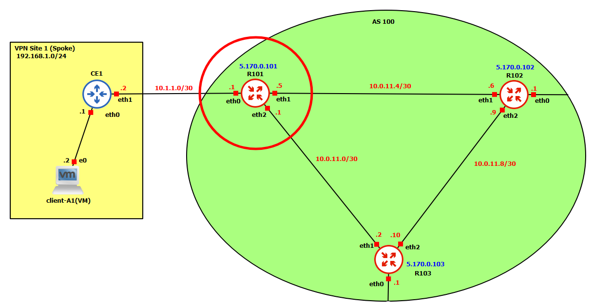
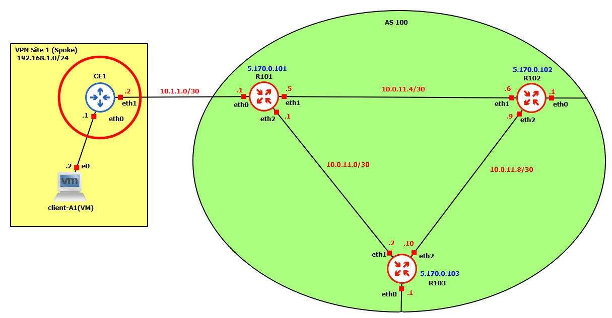

# NSD-Final

## Setup 

### Basic networking

#### R101

Starting from the AS100 routers, which are FRR routers (`nsdcourse/frr:latest`) configured via `vytsh` configuration terminal.

The most important steps for R101 are presented below. (It's analogous for R102 and R103)



- Set address for the interface toward CE1:
```
interface eth0
 ip address 10.1.1.1/30
exit
```
- Set addresses for the interfaces toward the other R10x routers in the AS100:
```
interface eth1
 ip address 10.0.11.5/30
exit
!
interface eth2
 ip address 10.0.11.1/30
exit
```
- Also setup the address for the loobpack interface:
```
interface lo
 ip address 5.170.0.101/32
exit
```

-  Set static route for the link toward CE1:
```
ip route 10.1.1.2/32 eth0
```

- Setup OSPF for the internal AS100 reachability:
```
router ospf
 ospf router-id 5.170.0.101
 network 5.170.0.101/32 area 0
 network 10.0.11.0/30 area 0
 network 10.0.11.4/30 area 0
exit
```

- Setup iBGP:
```
router bgp 100
 bgp router-id 5.170.0.101
 neighbor 5.170.0.102 remote-as 100
 neighbor 5.170.0.102 update-source 5.170.0.101
 neighbor 5.170.0.103 remote-as 100
 neighbor 5.170.0.103 update-source 5.170.0.101
 !
 address-family ipv4 unicast
  network 10.1.1.2/32
  neighbor 5.170.0.102 next-hop-self
  neighbor 5.170.0.103 next-hop-self
 exit-address-family
exit
```

#### CE1

The CEx devices are Linux routers (`nsdcourse/basenet:latest`), configured via a `init.sh` script.

The most important steps for CE1 are presented below.



- Set address for the interface toward R101:
```
ip addr add 10.1.1.2/30 dev eth1
```

- Set the address for the interface toward the VPN Site 1:
```
ip addr add 192.168.1.1/24 dev eth0
```

- Enable forwarding and setup default route:
```
echo 1 > /proc/sys/net/ipv4/ip_forward
ip route add default via 10.1.1.1
```

#### Client A1

Clients are either simple clients (`nsdcourse/basenet:latest`) or VM (`debian-13.3.0-amd64-netinst`), configured via a `init.sh` script.

The most important steps for Client A1 are presented below.


- Set address for the interface toward CE1 and setup the default route:
```
ip addr add 192.168.1.2/24 dev ens33
ip route add default via 192.168.1.1
```

